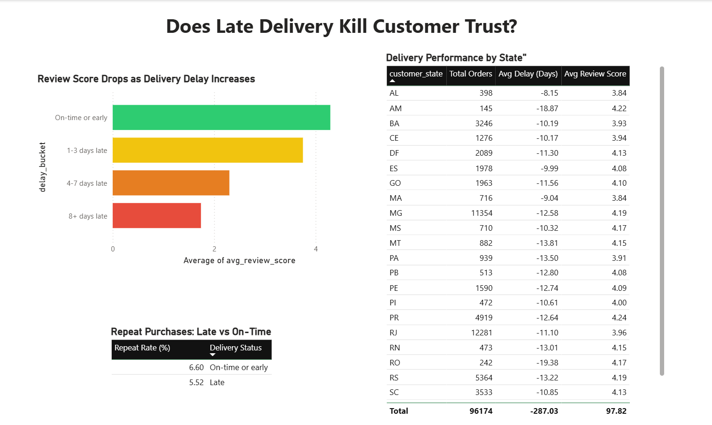

# Does Late Delivery Kill Customer Trust?
### E-Commerce Delivery Delay Impact Analysis

## Problem
Analyzed whether delivery delays affect customer review scores and repeat purchase
behavior, using the Olist Brazilian E-Commerce dataset, to identify where the
business should focus logistics improvements.

## Data
~96,000 delivered orders from Kaggle's "Brazilian E-Commerce Public Dataset by
Olist," including delivery dates, review scores, and customer location across
9 linked tables (orders, order_reviews, customers, order_items, sellers, products,
order_payments, geolocation, category_translation).

## Tools
- **SQL (SQLite)** — calculating delivery delay, joining tables, aggregating insights
- **Excel** — quick data reshaping between SQL and Power BI
- **Power BI** — interactive dashboard with color-coded visuals

## Process
1. Loaded all 9 CSV files into a SQLite database
2. Filtered to delivered orders and calculated delivery delay (actual vs. estimated date)
3. Joined delay data with review scores and bucketed orders by delay length
4. Built a real customer-level table (`customer_unique_id`) to correctly measure
   repeat purchases, since `customer_id` is unique per order in this dataset
5. Compared repeat purchase rates for delayed vs. on-time customers
6. Broke down delay and review score by state
7. Built an interactive Power BI dashboard with color-coded charts and tables

## Key Insights
- **Delay severity strongly predicts dissatisfaction**: orders delayed 8+ days
  averaged a **1.74-star** review vs. **4.29 stars** for on-time orders — a drop
  of 2.55 stars. The steepest decline happens once delay exceeds 3 days.
- **Late deliveries are linked to lower repeat purchases**: delayed customers had
  a **5.52%** repeat purchase rate vs. **6.60%** for on-time customers — roughly
  a 16% relative drop.
- **Geography is a weaker driver than delay length**: no state was late on
  average, and review scores stayed relatively flat (3.84–4.25) across all
  states. Alagoas (AL) had the narrowest delivery buffer and lowest review
  average among high-volume states.

## Impact
Delay length — not customer location — is the primary driver of dissatisfaction
and lower repeat purchases in this dataset. This suggests the business should:
- Set more accurate delivery estimates rather than overly wide buffers
- Prioritize fixing the small share of orders that slip past the 3-4 day delay
  threshold, since that's where review scores and retention drop sharply
- Investigate logistics in narrow-buffer states like Alagoas specifically,
  while treating delay severity (not region) as the core lever for improving
  customer retention

## Dashboard Preview

## Files in this repo
- `queries.sql` — all SQL queries used, in order, with inline result notes
- `delivery_delay_dashboard.pbix` — interactive Power BI dashboard
- `dashboard_screenshot.png` — static preview of the dashboard
